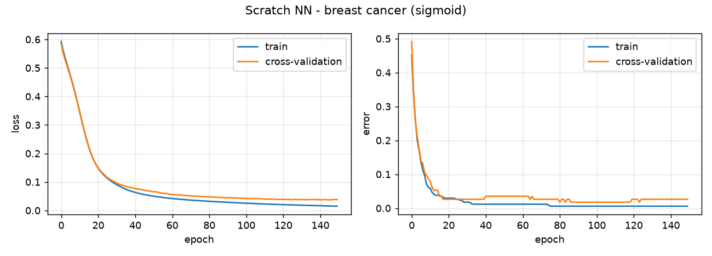
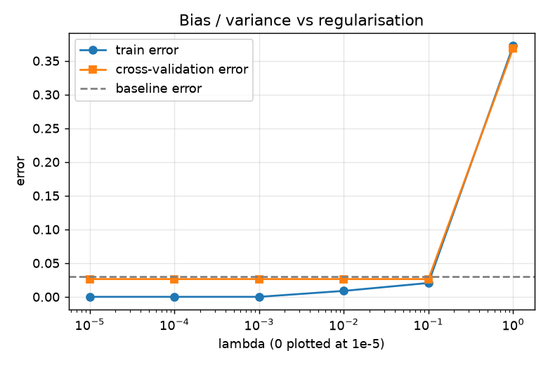
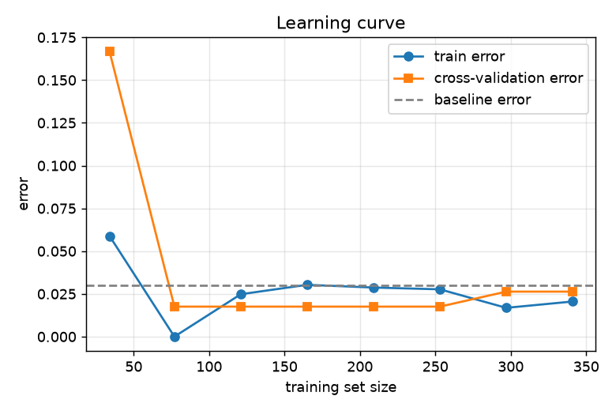
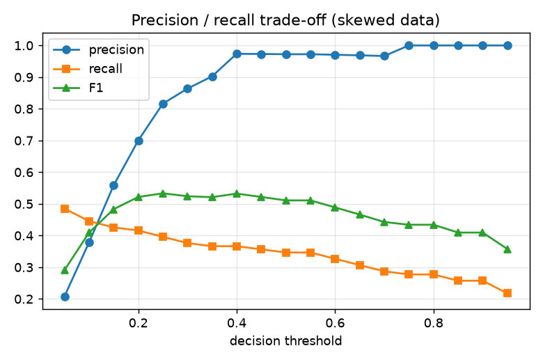
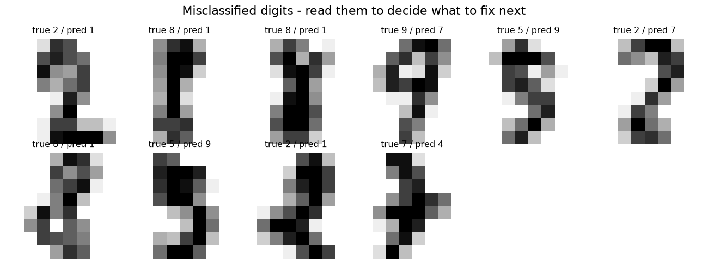
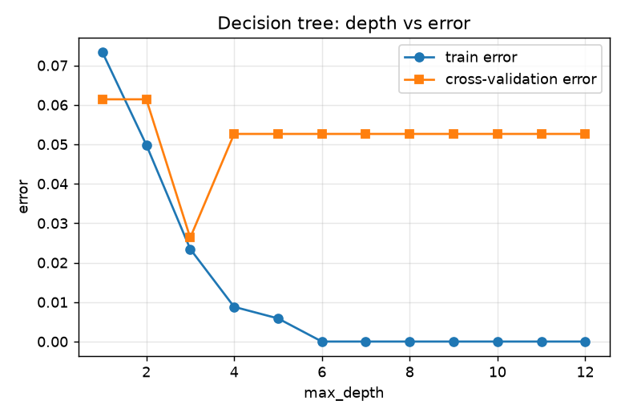
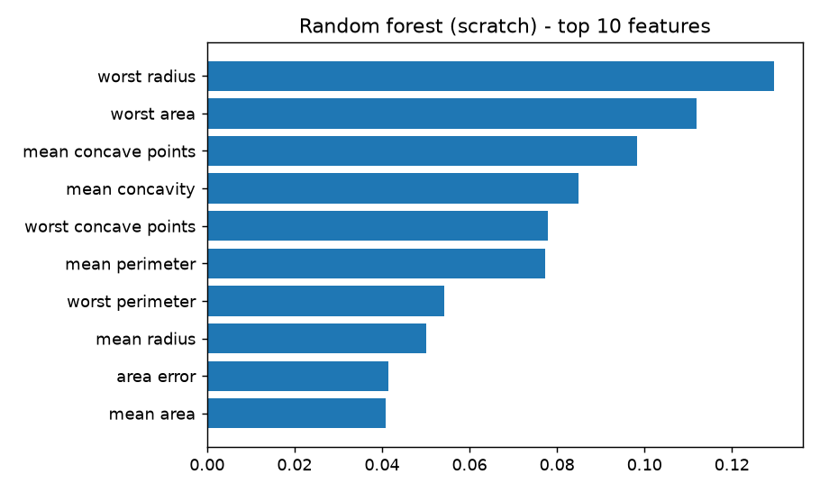
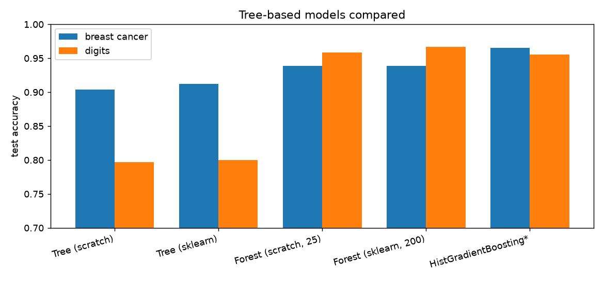

# Advanced Learning Algorithms Lab

 

A hands-on project that puts every topic of the **Advanced Learning Algorithms** course (Machine Learning Specialization, course 2) into working code. Instead of only calling libraries, the core algorithms are **implemented from scratch in NumPy** and then compared against TensorFlow, scikit-learn and XGBoost....

## What is inside

| Course week | Topics | Where it lives |
|---|---|---|
| **1. Neural networks** | neurons & layers, forward propagation, vectorised matrix multiplication | `alg_lab/nn_scratch.py`, `experiments/exp1_scratch_nn.py` |
| **2. Neural network training** | TensorFlow training, ReLU / sigmoid / softmax, multiclass classification, Adam, back-propagation | `alg_lab/nn_scratch.py`, `alg_lab/tf_models.py`, `experiments/exp2_tensorflow.py` |
| **3. Advice for applying ML** | train / cv / test split, bias & variance, regularisation, learning curves, baseline performance, error analysis, skewed datasets, precision / recall | `alg_lab/diagnostics.py`, `experiments/exp3_diagnostics.py` |
| **4. Decision trees** | entropy, information gain, continuous & one-hot features, sampling with replacement, random forest, XGBoost | `alg_lab/tree_scratch.py`, `experiments/exp4_trees.py` |

### Highlights
- Neural network with **hand-written back-propagation and Adam**, verified against numerical gradients in the test suite.
- **Decision tree + random forest from scratch** (entropy, information gain, bootstrap sampling). The scratch tree matches scikit-learn closely.
- Correct ML workflow: scaler fitted on train only, **lambda chosen on the cross-validation set**, test set used once.
- Shows why **accuracy is misleading on skewed data** and how the decision threshold trades precision against recall.
- Fully offline: all datasets ship with scikit-learn or are generated locally.

## Quick start

```bash
git clone https://github.com/<priyanshu2734>/advanced-learning-algorithms-lab.git
cd advanced-learning-algorithms-lab
python -m venv .venv && source .venv/bin/activate      # Windows: .venv\Scripts\activate
pip install -r requirements.txt

python main.py all            # run everything, figures go to results/
python main.py nn             # or: tf | diagnostics | trees
pytest -q                     # run the tests
```

Experiment 2 (Keras) and the real XGBoost model are optional extras:

```bash
pip install -r requirements-optional.txt
```

Without them, experiment 2 is skipped and experiment 4 falls back to scikit-learn's `HistGradientBoostingClassifier` (marked with `*` in the output).

## Results

Fixed random seeds, one stratified 60/20/20 split. Numbers below were produced by `python main.py all` (without the optional TensorFlow / XGBoost packages).

**Neural network from scratch (test accuracy)**

| Task | Architecture | Test accuracy |
|---|---|---|
| Breast cancer (binary, sigmoid) | 30-16-8-1 | 97.4 % |
| Digits (10 classes, softmax) | 64-64-32-10 | 96.7 % |

**Tree-based models (test accuracy)**

| Model | Breast cancer | Digits |
|---|---|---|
| Decision tree (scratch) | 90.4 % | 79.7 % |
| Decision tree (scikit-learn) | 91.2 % | 80.0 % |
| Random forest (scratch, 25 trees) | 93.9 % | 95.8 % |
| Random forest (scikit-learn, 200 trees) | 93.9 % | 96.7 % |
| Gradient boosting (HistGradientBoosting*) | 96.5 % | 95.6 % |

**Skewed data (2.5 % positives):** a model that always predicts "normal" scores 97.5 % accuracy while catching nothing. The trained network reaches precision 0.97 but recall only 0.35 at the default 0.5 threshold, so lowering the threshold to gain recall is the next step (see the trade-off plot).

Small test sets make single-split numbers noisy (about ±1-2 %), so treat differences of that size as ties.

### Figures (in `results/`)

| | |
|---|---|
|  |  |
|  |  |
|  |  |
|  |  |

## Project structure

```
advanced-learning-algorithms-lab/
├── alg_lab/
│   ├── data.py            # datasets + train/cv/test split
│   ├── nn_scratch.py      # NumPy neural network (forward, backprop, Adam, L2)
│   ├── tf_models.py       # Keras equivalents (linear output + from_logits loss)
│   ├── diagnostics.py     # bias/variance, lambda sweep, learning curve, precision/recall
│   └── tree_scratch.py    # entropy, information gain, decision tree, random forest
├── experiments/           # exp1-exp4, each runnable on its own
├── tests/test_core.py     # gradient check, entropy / information-gain checks, sanity tests
├── results/               # generated figures and summary.json
├── main.py                # CLI entry point
└── .github/workflows/ci.yml
```

## Key takeaways
1. A hidden-layer ReLU network trained with Adam reaches ~97 % on both tasks, and every gradient is verified numerically.
2. Large train / cv gaps mean high variance; the lambda sweep shows the fix, and too much regularisation (lambda = 1) flips the problem to high bias.
3. Single trees overfit and are unstable; random forests and boosting fix that, which is why they are the default for tabular data.
4. On imbalanced data, always look at precision, recall and F1, not accuracy alone.

## Ideas for extending the project
- Swap in your own tabular dataset (e.g. a heart-disease CSV) by adding a loader in `data.py`.
- Add `class_weight` / resampling for the skewed experiment, and a precision-recall curve.
- Tune XGBoost with early stopping on the cv set.

## License
MIT - see [LICENSE](LICENSE).
